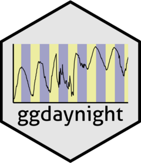
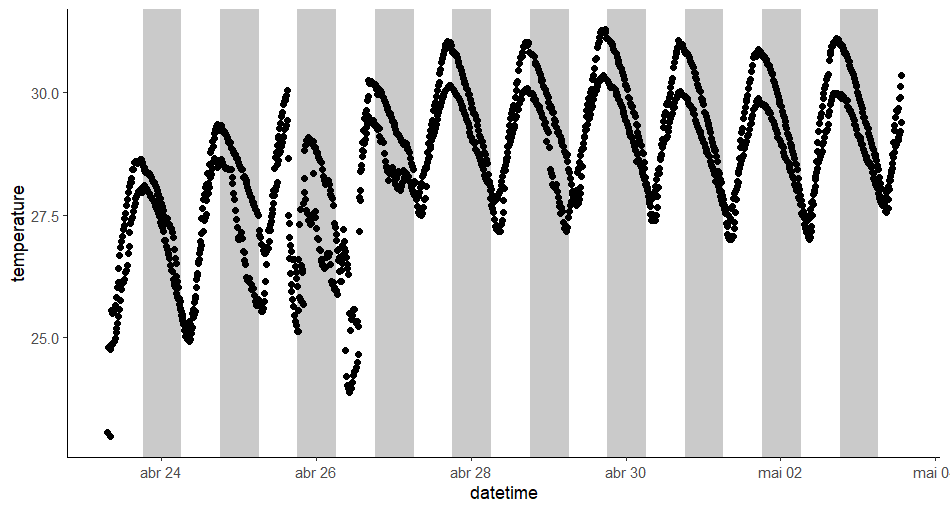
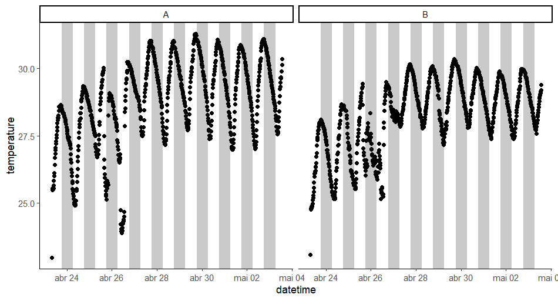
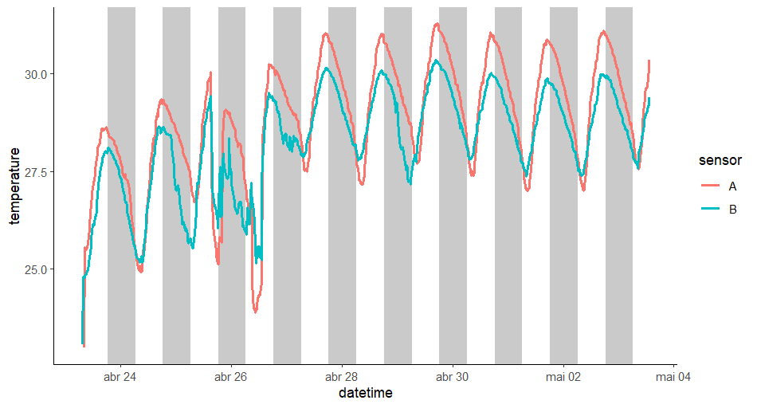
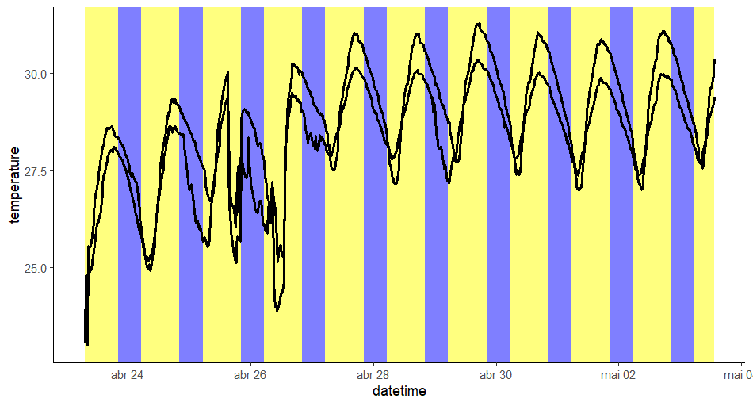

# ggdaynight 

`ggdaynight` is an R package that adds a day/night pattern to ggplot2 plots. Daytime is represented by rectangles filled with a specified `day_fill` color and nighttime by rectangles filled with a specified `night_fill` color. The pattern is created along the x-axis, which must be a datetime variable.

## Installation

You can install the development version of `ggdaynight` from GitHub with:

```
# Install devtools if not already installed
if (!requireNamespace("devtools", quietly = TRUE)) {
  install.packages("devtools")
}

# Install ggdaynight from GitHub
devtools::install_github("GabrielSlPires/ggdaynight")
```
## Usage
Basic Usage with Default Parameters
```
library(ggplot2)
library(ggdaynight)

ggplot(daynight_temperature, aes(datetime, temperature)) +
  geom_daynight() +
  geom_point() +
  theme_classic()
```


Basic Usage with Faceting by Sensor
```
ggplot(daynight_temperature, aes(datetime, temperature)) +
  geom_daynight() +
  geom_point() +
  facet_wrap(vars(sensor)) +
  theme_classic()
```


Usage with Lines and Color by Sensor
```
ggplot(daynight_temperature, aes(datetime, temperature, color = sensor)) +
  geom_daynight() +
  geom_line(linewidth = 1) +
  theme_classic()
```


Custom Day and Night Fill Colors, Custom Sunrise and Sunset Times, and Adjusted Alpha
```
ggplot(daynight_temperature, aes(datetime, temperature, group = sensor)) +
  geom_daynight(day_fill = "yellow", night_fill = "blue",
                sunrise = 5, sunset = 20, alpha = 0.5) +
  geom_line(linewidth = 1) +
  theme_classic()
```


### Function Details

#### geom_daynight

Adds a day/night pattern to a ggplot object.

##### Arguments

* `day_fill`: The fill color for daytime rectangles. Defaults to `"white"`.
* `night_fill`: The fill color for nighttime rectangles. Defaults to `"grey30"`.
* `sunrise`: The hour at which daytime starts. Defaults to 6 (6 AM).
* `sunset`: The hour at which nighttime starts. Defaults to 18 (6 PM).
* `...`: Additional arguments passed to `geom_rect`.

##### Value

A ggplot2 layer representing the day/night pattern.

### Contributing

Please feel free to submit issues and pull requests to the repository. For major changes, please open an issue first to discuss what you would like to change.
